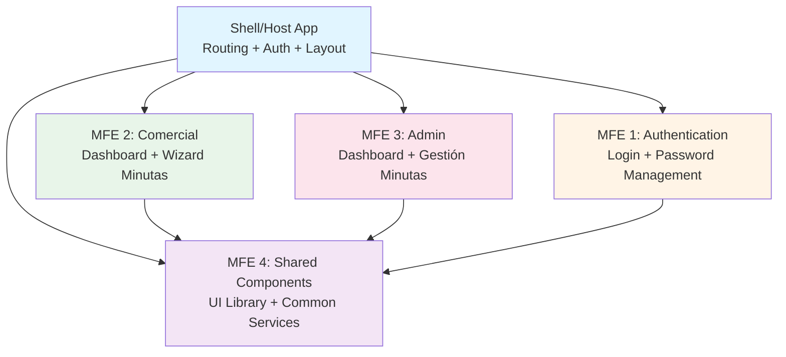

# Análisis y Recomendaciones: Arquitectura Micro Frontend para AppMinuta

## 📋 Resumen Ejecutivo

Tu aplicación **AppMinuta** es actualmente un **monolito frontend** construido con React, Vite, React Router, y Supabase. Después de analizar toda la estructura, he identificado **4 micro frontends naturales** basados en dominios de negocio y responsabilidades.

---

## 🏗️ Estructura Actual del Frontend

### Tecnologías Principales
- **Framework**: React 18.3 + TypeScript
- **Build Tool**: Vite 5.4
- **Routing**: React Router v6
- **State Management**: React Context (Auth, Wizard) + TanStack Query
- **UI**: Radix UI + Tailwind CSS + shadcn/ui
- **Backend**: Supabase (Auth + Database)

### Organización de Carpetas

```
frontend/src/
├── components/
│   ├── auth/              # Autenticación (Login, ChangePassword)
│   ├── minutas/           # Gestión de minutas (7 componentes)
│   ├── wizard/            # Wizard de creación (13 componentes)
│   ├── unidades/          # Gestión de unidades
│   └── ui/                # 49 componentes de UI (shadcn)
├── pages/
│   ├── admin/             # Dashboard y gestión admin
│   ├── comercial/         # Dashboard comercial
│   └── error/             # Páginas de error
├── services/
│   ├── api.ts             # Cliente API base
│   ├── minutas.ts         # 23 funciones de minutas
│   ├── unidades.ts        # 27 funciones de unidades
│   ├── proyectos.ts       # Gestión de proyectos
│   └── rbac.ts            # Control de acceso
├── context/
│   ├── AuthContext.tsx    # Estado de autenticación
│   └── WizardContext.tsx  # Estado del wizard
├── hooks/                 # 8 custom hooks
└── schemas/               # Validación con Zod
```

### Rutas Principales

```
/login                          → LoginPage
/change-password                → ForceChangePasswordPage
/comercial/dashboard            → DashboardComercial (requiere rol 'comercial')
/comercial/wizard               → Wizard (crear minutas provisorias)
/admin/dashboard                → DashboardAdmin (requiere rol 'administrador')
```

---

## 🎯 Propuesta de Micro Frontends

### Estrategia Recomendada: **Module Federation** (Webpack 5 / Vite)

Basándome en el análisis de tu código, recomiendo dividir la aplicación en **4 micro frontends independientes**:



---

## 📦 Detalle de Cada Micro Frontend

### **MFE 1: Shell/Host Application** 🏠

**Responsabilidad**: Orquestación, routing global, autenticación base, layout compartido

**Contenido**:
- `App.tsx` (router principal)
- `ProtectedRoute` y `PasswordChangeRoute`
- Providers globales: `AuthProvider`, `QueryClientProvider`, `TooltipProvider`
- Componentes de layout: `MobileBlocker`, `Toaster`
- Routing de alto nivel entre micro frontends

**Tecnologías**:
- React Router v6
- Module Federation (host)
- Context API para auth global

**Rutas**:
```typescript
/                    → Redirect to /login
/login               → Remote: @auth/LoginPage
/change-password     → Remote: @auth/ChangePasswordPage
/comercial/*         → Remote: @comercial/App
/admin/*             → Remote: @admin/App
```

---

### **MFE 2: Authentication** 🔐

**Responsabilidad**: Gestión completa de autenticación y seguridad

**Contenido**:
```
components/auth/
  ├── LoginForm.tsx
  └── ChangePasswordForm.tsx
pages/
  ├── LoginPage.tsx
  └── ForceChangePasswordPage.tsx
  └── PerfilIncompletoPage.tsx
services/
  └── rbac.ts (parcial)
hooks/
  ├── useAuth.ts
  ├── useCSRF.ts
  └── usePermissions.ts
context/
  └── AuthContext.tsx
```

**Expone**:
- `LoginPage`
- `ForceChangePasswordPage`
- `useAuth` hook
- `AuthContext`

**Dependencias**:
- Supabase Auth
- Shared UI components

---

### **MFE 3: Comercial** 💼

**Responsabilidad**: Dashboard y creación de minutas para usuarios comerciales

**Contenido**:
```
pages/comercial/
  └── DashboardComercial.tsx
pages/
  └── Wizard.tsx
components/wizard/
  ├── WizardLayout.tsx
  ├── ResumenCard.tsx
  ├── ResumenCompleto.tsx
  ├── DemoModeToggle.tsx
  └── steps/ (9 componentes)
      ├── Step1ProyectoUnidad.tsx
      ├── Step2Comercial.tsx
      ├── Step3ComposicionFSB.tsx
      ├── Step4Pago.tsx
      ├── Step5Cargos.tsx
      ├── Step6ReglasFinanciacion.tsx
      ├── Step6Salida.tsx
      ├── UnidadFormulario.tsx
      └── FilterSelect.tsx
components/minutas/
  ├── GuardarMinutaButton.tsx
  ├── ConfirmarGuardarMinuta.tsx
  └── DetalleMinutaModal.tsx (vista comercial)
services/
  ├── minutas.ts (funciones de creación)
  ├── unidades.ts
  └── proyectos.ts
context/
  └── WizardContext.tsx
hooks/
  ├── useUnidadFilters.ts
  ├── usePDFGenerator.ts
  └── useDownloadBlob.ts
```

**Rutas Internas**:
```
/dashboard           → DashboardComercial
/wizard              → Wizard (crear minuta)
/minutas/:id         → Ver detalle minuta
```

**Expone**:
- `ComercialApp` (router interno)
- `DashboardComercial`
- `Wizard`

**Dependencias**:
- Shared UI components
- Auth context (del Shell)
- Services API

---

### **MFE 4: Admin** 👨‍💼

**Responsabilidad**: Dashboard administrativo y gestión de minutas (provisorias y definitivas)

**Contenido**:
```
pages/admin/
  ├── DashboardAdmin.tsx
  ├── DetalleMinutaProvisoria.tsx
  ├── DetalleMinutaDefinitiva.tsx
  └── components/
      └── MinutaEditarTab.tsx
components/minutas/
  ├── ListaMinutasProvisoriasAdmin.tsx
  ├── ListaMinutasDefinitivasAdmin.tsx
  ├── GuardarMinutaDefinitivaButton.tsx
  └── ConfirmarGuardarMinutaDefinitiva.tsx
services/
  └── minutas.ts (funciones de gestión admin)
```

**Rutas Internas**:
```
/dashboard                  → DashboardAdmin
/minutas/:id/provisoria     → DetalleMinutaProvisoria
/minutas/:id/definitiva     → DetalleMinutaDefinitiva
```

**Expone**:
- `AdminApp` (router interno)
- `DashboardAdmin`

**Dependencias**:
- Shared UI components
- Auth context (del Shell)
- Services API

---

### **MFE 5: Shared Library** 📚

**Responsabilidad**: Componentes UI, utilidades, y servicios compartidos

**Contenido**:
```
components/ui/              # 49 componentes shadcn/ui
  ├── button.tsx
  ├── input.tsx
  ├── select.tsx
  ├── dialog.tsx
  ├── table.tsx
  └── ... (todos los componentes de Radix UI)
lib/
  ├── api-client.ts         # apiFetch base
  ├── supabase.ts
  └── utils.ts
schemas/
  ├── minuta.schema.ts
  ├── password.schema.ts
  └── ... (validaciones Zod)
utils/
  ├── validateRequest.ts
  └── sanitize.ts
types/
  └── wizard.ts
hooks/
  ├── use-toast.ts
  └── use-mobile.tsx
```

**Expone**:
- Todos los componentes UI
- `apiFetch` cliente
- Schemas de validación
- Utilidades comunes

**Tecnología**:
- Publicado como paquete npm privado O
- Expuesto vía Module Federation

---

## 🔧 Implementación Técnica

### Opción 1: **Module Federation con Vite** (Recomendada)

**Ventajas**:
- ✅ Carga dinámica de módulos en runtime
- ✅ Compartir dependencias (React, React Router)
- ✅ Desarrollo independiente
- ✅ Deploy independiente
- ✅ Compatible con Vite (tu stack actual)

**Configuración Base**:

#### **Shell App** (`vite.config.ts`)
```typescript
import { defineConfig } from 'vite';
import react from '@vitejs/plugin-react-swc';
import federation from '@originjs/vite-plugin-federation';

export default defineConfig({
  plugins: [
    react(),
    federation({
      name: 'shell',
      remotes: {
        auth: 'http://localhost:5001/assets/remoteEntry.js',
        comercial: 'http://localhost:5002/assets/remoteEntry.js',
        admin: 'http://localhost:5003/assets/remoteEntry.js',
        shared: 'http://localhost:5004/assets/remoteEntry.js',
      },
      shared: {
        react: { singleton: true, requiredVersion: '^18.3.1' },
        'react-dom': { singleton: true, requiredVersion: '^18.3.1' },
        'react-router-dom': { singleton: true },
        '@supabase/supabase-js': { singleton: true },
        '@tanstack/react-query': { singleton: true },
      }
    })
  ],
  build: {
    target: 'esnext',
    minify: false,
    cssCodeSplit: false
  }
});
```

#### **Auth MFE** (`vite.config.ts`)
```typescript
import { defineConfig } from 'vite';
import react from '@vitejs/plugin-react-swc';
import federation from '@originjs/vite-plugin-federation';

export default defineConfig({
  plugins: [
    react(),
    federation({
      name: 'auth',
      filename: 'remoteEntry.js',
      exposes: {
        './LoginPage': './src/pages/LoginPage.tsx',
        './ChangePasswordPage': './src/pages/ForceChangePasswordPage.tsx',
        './AuthContext': './src/context/AuthContext.tsx',
      },
      shared: {
        react: { singleton: true },
        'react-dom': { singleton: true },
        'react-router-dom': { singleton: true },
      }
    })
  ],
  build: {
    target: 'esnext',
    minify: false,
    cssCodeSplit: false
  },
  server: {
    port: 5001
  }
});
```

**Uso en Shell**:
```typescript
// App.tsx
import { lazy, Suspense } from 'react';

const LoginPage = lazy(() => import('auth/LoginPage'));
const ComercialApp = lazy(() => import('comercial/App'));
const AdminApp = lazy(() => import('admin/App'));

const routes = [
  {
    path: '/login',
    element: (
      <Suspense fallback={<Loading />}>
        <LoginPage />
      </Suspense>
    )
  },
  {
    path: '/comercial/*',
    element: (
      <Suspense fallback={<Loading />}>
        <ComercialApp />
      </Suspense>
    )
  },
  // ...
];
```

---

### Opción 2: **Monorepo con Turborepo/Nx**

**Ventajas**:
- ✅ Gestión centralizada de dependencias
- ✅ Build cache compartido
- ✅ Más fácil de refactorizar inicialmente
- ❌ No hay carga dinámica (bundle único)

**Estructura**:
```
appminuta/
├── apps/
│   ├── shell/              # Host app
│   ├── auth/               # Auth MFE
│   ├── comercial/          # Comercial MFE
│   └── admin/              # Admin MFE
├── packages/
│   ├── ui/                 # Shared UI components
│   ├── services/           # API services
│   └── types/              # TypeScript types
├── package.json
└── turbo.json
```

---

## 🚀 Plan de Migración Recomendado

### **Fase 1: Preparación** (1-2 semanas)

> [!IMPORTANT]
> No hagas cambios destructivos. Mantén el monolito funcionando.

1. **Auditoría de dependencias**
   - Identificar dependencias compartidas vs específicas
   - Documentar imports cruzados entre módulos

2. **Crear estructura de carpetas**
   ```
   frontend/
   ├── apps/
   │   ├── shell/
   │   ├── auth/
   │   ├── comercial/
   │   └── admin/
   └── packages/
       └── shared/
   ```

3. **Configurar Turborepo o Nx**
   ```bash
   npx create-turbo@latest
   ```

4. **Mover componentes UI a `packages/shared`**
   - Copiar (no mover) `components/ui/` → `packages/shared/ui/`
   - Configurar exports en `package.json`

---

### **Fase 2: Extraer Shared Library** (1 semana)

1. **Crear `packages/shared`**
   ```
   packages/shared/
   ├── ui/                 # Componentes UI
   ├── services/           # API clients
   ├── schemas/            # Zod schemas
   ├── utils/              # Utilidades
   └── package.json
   ```

2. **Configurar exports**
   ```json
   {
     "name": "@appminuta/shared",
     "exports": {
       "./ui": "./ui/index.ts",
       "./services": "./services/index.ts",
       "./schemas": "./schemas/index.ts"
     }
   }
   ```

3. **Actualizar imports en el monolito**
   ```typescript
   // Antes
   import { Button } from '@/components/ui/button';
   
   // Después
   import { Button } from '@appminuta/shared/ui';
   ```

---

### **Fase 3: Extraer Auth MFE** (1 semana)

1. **Crear `apps/auth`**
   - Mover `components/auth/`
   - Mover `pages/LoginPage.tsx`, `ForceChangePasswordPage.tsx`
   - Mover `context/AuthContext.tsx`

2. **Configurar Module Federation**
   - Exponer `LoginPage`, `ChangePasswordPage`, `AuthContext`

3. **Actualizar Shell**
   - Importar remotos desde `auth`
   - Mantener routing en Shell

4. **Testing**
   - Verificar login funciona
   - Verificar cambio de contraseña
   - Verificar RBAC

---

### **Fase 4: Extraer Comercial MFE** (2 semanas)

1. **Crear `apps/comercial`**
   - Mover `pages/comercial/`
   - Mover `pages/Wizard.tsx`
   - Mover `components/wizard/`
   - Mover `context/WizardContext.tsx`

2. **Configurar routing interno**
   ```typescript
   // apps/comercial/src/App.tsx
   const routes = [
     { path: '/dashboard', element: <DashboardComercial /> },
     { path: '/wizard', element: <Wizard /> },
   ];
   ```

3. **Exponer vía Module Federation**
   ```typescript
   exposes: {
     './App': './src/App.tsx'
   }
   ```

---

### **Fase 5: Extraer Admin MFE** (2 semanas)

1. **Crear `apps/admin`**
   - Mover `pages/admin/`
   - Mover componentes de gestión de minutas

2. **Configurar routing interno**

3. **Testing completo**

---

### **Fase 6: Optimización** (1 semana)

1. **Performance**
   - Lazy loading de rutas
   - Code splitting
   - Preload de módulos críticos

2. **CI/CD**
   - Pipeline independiente por MFE
   - Deploy a diferentes URLs/CDN

3. **Monitoreo**
   - Error boundaries por MFE
   - Analytics de carga de módulos

---

## 📊 Comparación de Estrategias

| Criterio | Module Federation | Monorepo (Turborepo) | iFrames |
|----------|-------------------|----------------------|---------|
| **Independencia de deploy** | ✅ Sí | ❌ No | ✅ Sí |
| **Compartir código** | ✅ Excelente | ✅ Excelente | ❌ Difícil |
| **Performance** | ✅ Buena | ✅ Excelente | ⚠️ Regular |
| **Complejidad inicial** | ⚠️ Media | ✅ Baja | ✅ Baja |
| **Aislamiento de errores** | ✅ Bueno | ❌ Bajo | ✅ Excelente |
| **SEO** | ✅ Bueno | ✅ Bueno | ❌ Malo |
| **Experiencia de desarrollo** | ⚠️ Media | ✅ Excelente | ❌ Mala |

---

## ⚠️ Consideraciones Importantes

### **¿Cuándo NO usar Micro Frontends?**

> [!WARNING]
> Micro frontends agregan complejidad. Solo úsalos si:

- ✅ Tienes equipos separados trabajando en diferentes áreas
- ✅ Necesitas deploys independientes
- ✅ La aplicación es lo suficientemente grande (tu caso: SÍ)
- ✅ Tienes recursos para mantener la infraestructura

### **Desafíos a Considerar**

1. **Gestión de estado compartido**
   - Solución: Event bus o Context API en Shell
   - Ejemplo: Auth state debe ser accesible por todos

2. **Estilos compartidos**
   - Solución: Tailwind config en `shared` package
   - Usar CSS-in-JS o CSS Modules para evitar conflictos

3. **Versionado de dependencias**
   - Usar `singleton: true` en Module Federation
   - Mantener versiones sincronizadas en monorepo

4. **Testing E2E**
   - Configurar Playwright/Cypress para probar flujos completos
   - Mockear remotes en tests unitarios

5. **Performance**
   - Preload de módulos críticos
   - Lazy load de rutas secundarias
   - Monitorear bundle sizes

---

## 🎯 Recomendación Final

### **Para tu caso específico (AppMinuta)**:

**Estrategia híbrida recomendada**:

1. **Fase 1-2**: Usar **Turborepo** para organizar el código
   - Más fácil de implementar
   - Mantiene todo funcionando
   - Permite refactorizar sin romper nada

2. **Fase 3-6**: Migrar a **Module Federation**
   - Una vez que los límites estén claros
   - Deploy independiente de Comercial y Admin
   - Equipos pueden trabajar en paralelo

### **Estructura Final Recomendada**:

```
appminuta/
├── apps/
│   ├── shell/              # Host (Vercel)
│   ├── auth/               # Auth MFE (Vercel)
│   ├── comercial/          # Comercial MFE (Vercel)
│   └── admin/              # Admin MFE (Vercel)
├── packages/
│   ├── shared-ui/          # Componentes UI
│   ├── shared-services/    # API clients
│   └── shared-types/       # TypeScript types
├── turbo.json
└── package.json
```

### **Beneficios Esperados**:

- ✅ **Equipos independientes**: Comercial y Admin pueden trabajar sin conflictos
- ✅ **Deploys más rápidos**: Solo rebuild lo que cambia
- ✅ **Mejor organización**: Código agrupado por dominio
- ✅ **Escalabilidad**: Fácil agregar nuevos MFEs (ej: "Reportes", "Configuración")
- ✅ **Mantenibilidad**: Límites claros entre módulos

---

## 📚 Recursos Adicionales

- [Module Federation con Vite](https://github.com/originjs/vite-plugin-federation)
- [Turborepo Docs](https://turbo.build/repo/docs)
- [Micro Frontends Pattern](https://martinfowler.com/articles/micro-frontends.html)
- [Webpack Module Federation](https://webpack.js.org/concepts/module-federation/)

---

## ❓ Próximos Pasos

1. **Revisar esta propuesta** con tu equipo
2. **Decidir estrategia**: ¿Turborepo primero o Module Federation directo?
3. **Crear POC** con un MFE pequeño (ej: Auth)
4. **Validar performance** y experiencia de desarrollo
5. **Iterar** y migrar gradualmente

¿Tienes preguntas sobre alguna parte específica? ¿Quieres que profundice en algún aspecto?
